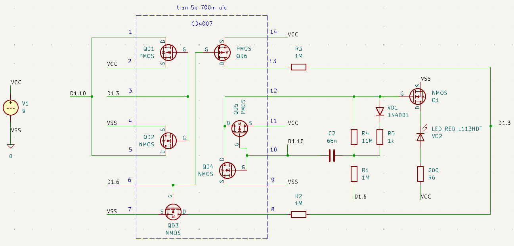
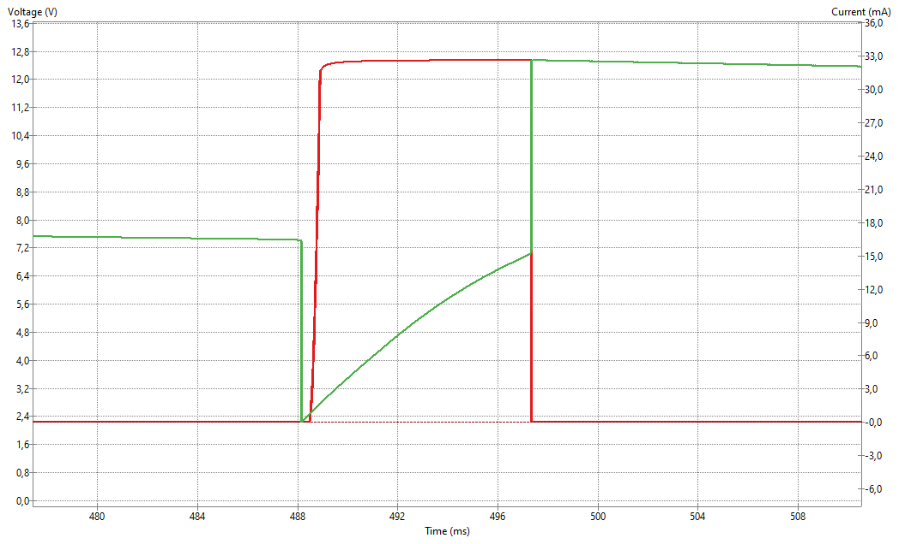

# x-1_led_tower
This is an electronic LED sculpture project, stylized as some generic telecommunication tower and inspired by @mohitbhoite cool works.
The project will be break down to next parts:
1. **Electronic circuit**. Developed in KiCAD. Circuit from Frank Sichla's book. SPICE models for simulation taken from Internet
2. **3D model**. Developed in FreeCAD
3. **Assembly**. The most interesting part - building sculpture itself

## v.1 KiCAD circuit

## v.1 KiCAD circuit SPICE flash spike simulation

## v.1 FreeCAD prototype

To be continued...
