# x-1_led_tower
This is an electronic LED sculpture project, stylized as some generic telecommunication tower and inspired by @mohitbhoite cool works.
The project will be break down to next parts:
1. **Electronic circuit**. Developed in KiCAD. Circuit from Frank Sichla's book. SPICE models for simulation taken from Internet
2. **3D model**. Developed in FreeCAD
3. **Assembly**. The most interesting part - building sculpture itself

## KiCAD circuit version 1
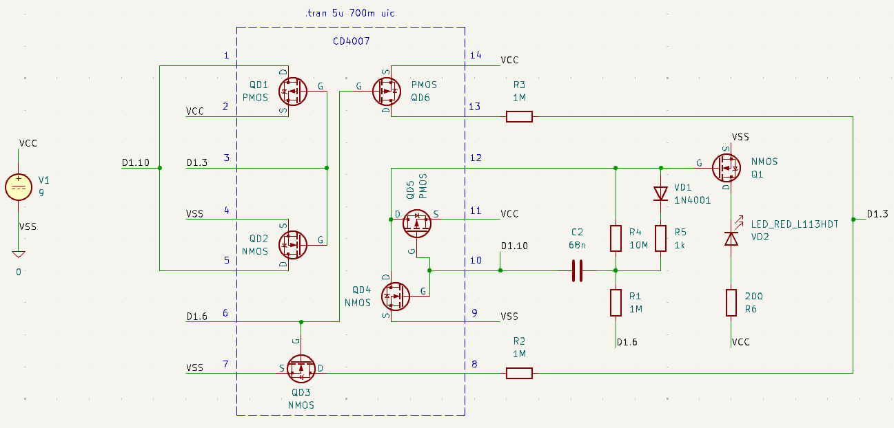

## KiCAD circuit SPICE flash spike simulation version 1
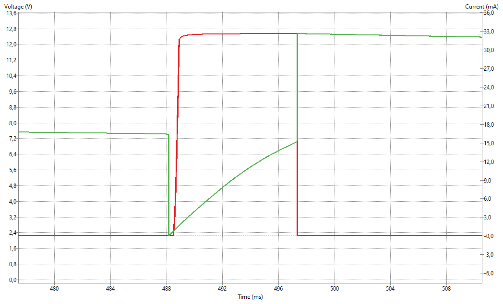

## FreeCAD 3D prototype version 1
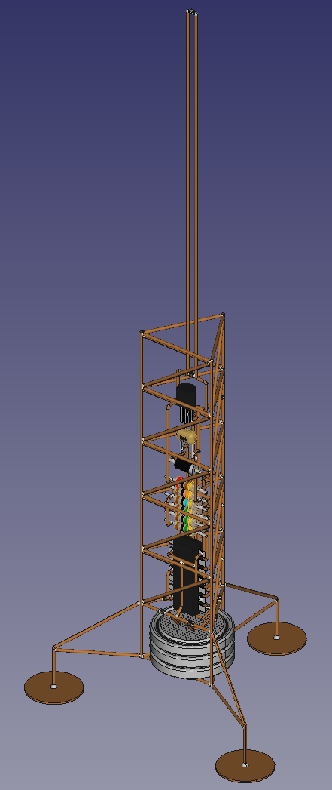

## Initial conditions changed
Due to a number of reasons, I can't solder at home yet. Therefore, I decided to redesign the tower project for assembly via crimping.

## FreeCAD 3D prototype version 2
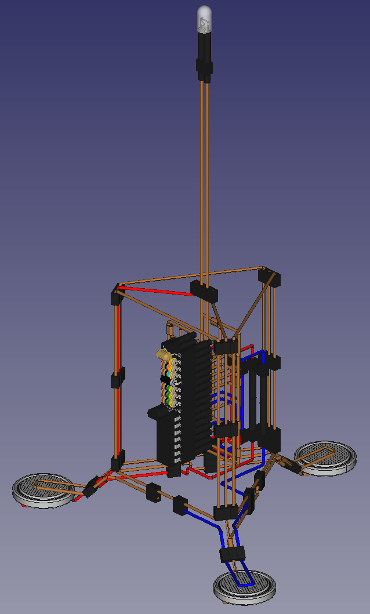

## FreeCAD 3D prototype version 2 assembly (failed)
Assembling the sculpture neatly using the blueprints of v2 turned out to be too difficult for me.  
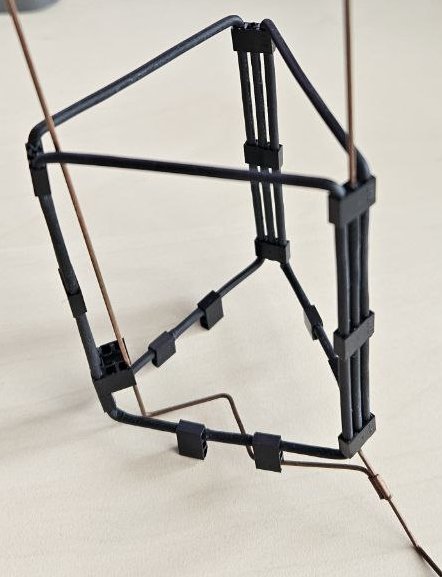

## FreeCAD 3D prototype version 3
I abandoned v2 and decided to remake it into v3 - lightweight and simplified.  
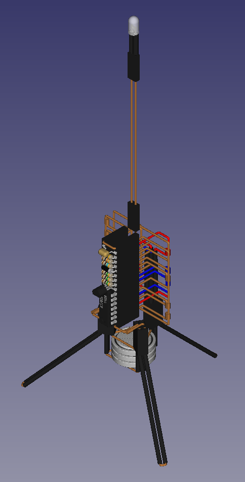

## FreeCAD 3D prototype version 3 assembly (failed)
Another fail with assembling triangle holder and bending. Threw it away...

## FreeCAD 3D prototype version 4
Another remake v4 - simplified for assembly  
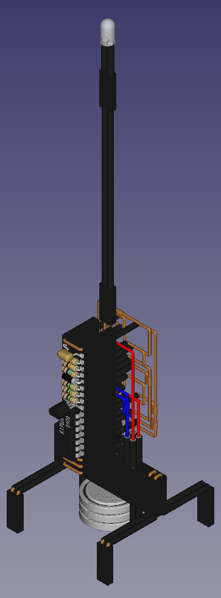

## FreeCAD 3D prototype version 4 assembly (abandoned)
I started the assembly, but only made the base, because I found a way to go back to soldering, to the original version of the sculpture.  
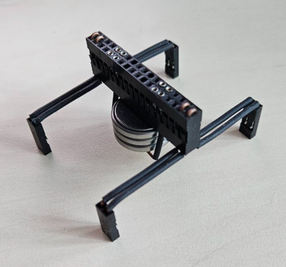

## FreeCAD 3D prototype version 1.1
At first I tried soldering with pine rosin. The joints were quite neat, but there was too much solid rosin residue that could not be washed off with isopropyl alcohol, and it was not possible to remove all the residue mechanically. I gave up on this flux.  
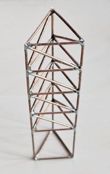

## FreeCAD 3D prototype version 1.1 (new flux)
I switched to liquid flux from Interflux (RP-65). I applied it with an applicator with a brush. The joints turned out nice and clean. But I failed again on soldering the negative battery holder. The 0603 SMD capacitors I wanted to use as separators turned out to be too fragile, the leads were torn off under load. So I decided to abandon the original idea again and move on to version 5 of the sculpture with a completely redesigned battery holder.  
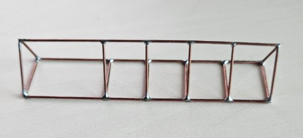

## FreeCAD 3D prototype version 5
Another remake v5 - improved battery holders and overall sculpture view.  
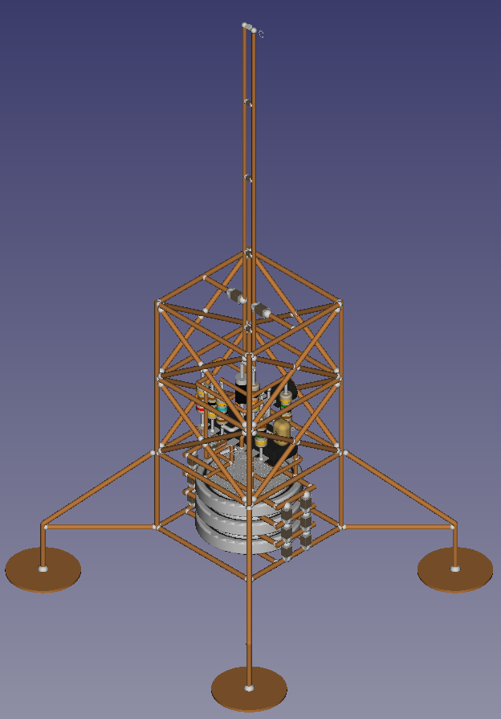

To be continued...
