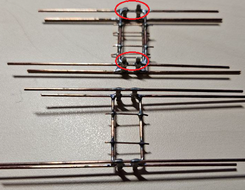
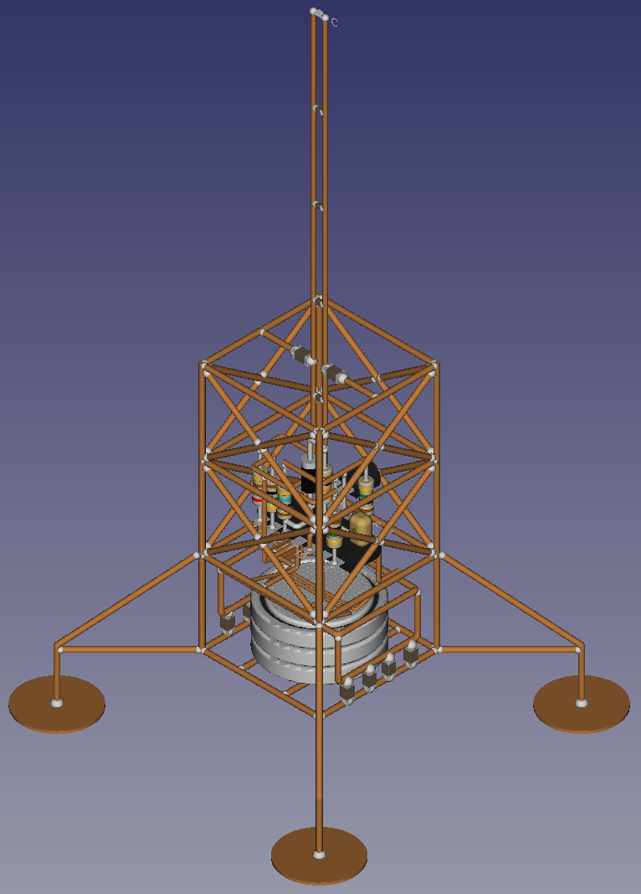
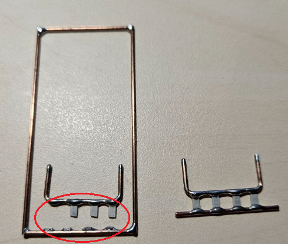
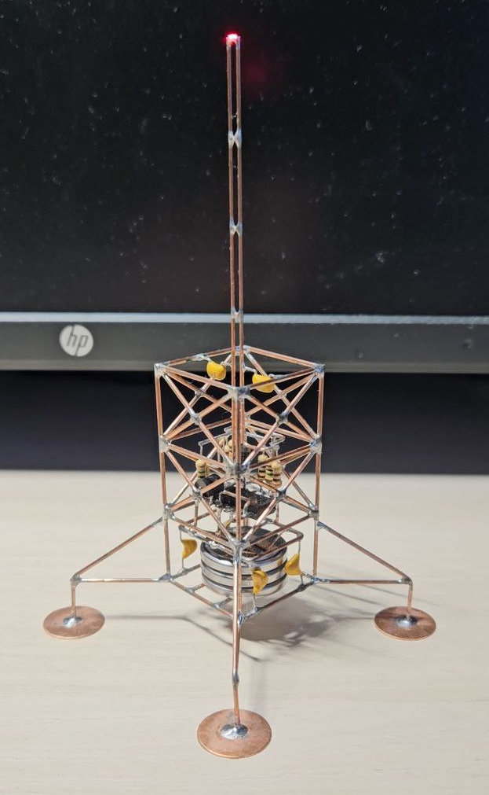
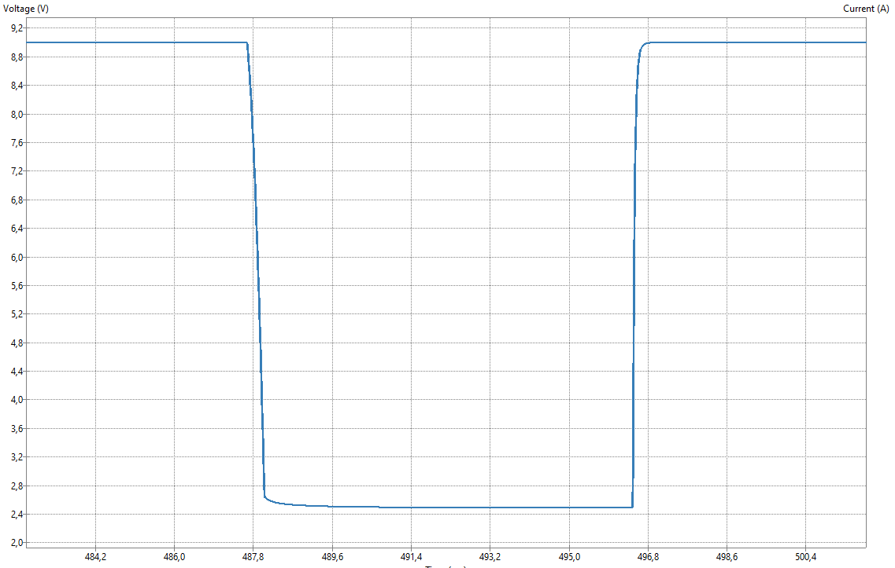
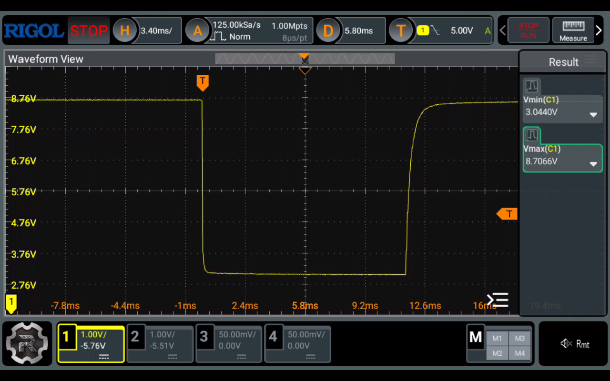

# x-1_led_tower
This is an electronic LED sculpture project, stylized as some generic telecommunication tower and inspired by @mohitbhoite cool works.
The project will be break down to next parts:
1. **Electronic circuit**. Developed in KiCAD. Circuit from Frank Sichla's book. SPICE models for simulation taken from Internet
2. **3D model**. Developed in FreeCAD
3. **Assembly**. The most interesting part - building sculpture itself

## KiCAD circuit version 1

## KiCAD circuit SPICE flash spike simulation version 1

## FreeCAD 3D prototype version 1

## Initial conditions changed
Due to a number of reasons, I can't solder at home yet. Therefore, I decided to redesign the tower project for assembly via crimping.

## FreeCAD 3D prototype version 2

## FreeCAD 3D prototype version 2 assembly (failed)
Assembling the sculpture neatly using the blueprints of v2 turned out to be too difficult for me.  

## FreeCAD 3D prototype version 3
I abandoned v2 and decided to remake it into v3 - lightweight and simplified.  

## FreeCAD 3D prototype version 3 assembly (failed)
Another fail with assembling triangle holder and bending. Threw it away...

## FreeCAD 3D prototype version 4
Another remake v4 - simplified for assembly  

## FreeCAD 3D prototype version 4 assembly (abandoned)
I started the assembly, but only made the base, because I found a way to go back to soldering, to the original version of the sculpture.  

## FreeCAD 3D prototype version 1.1
At first I tried soldering with pine rosin. The joints were quite neat, but there was too much solid rosin residue that could not be washed off with isopropyl alcohol, and it was not possible to remove all the residue mechanically. I gave up on this flux.  

## FreeCAD 3D prototype version 1.1 (new flux)
I switched to liquid flux from Interflux (RP-65). I applied it with an applicator with a brush. The joints turned out nice and clean. But I failed again on soldering the negative battery holder. The 0603 SMD capacitors I wanted to use as separators turned out to be too fragile, the leads were torn off under load. So I decided to abandon the original idea again and move on to version 5 of the sculpture with a completely redesigned battery holder.  

## FreeCAD 3D prototype version 5
Another remake v5 - improved battery holders and overall sculpture view.  

## FreeCAD 3D prototype version 5 assembly (failed)
I started the build of version 5 with the battery holder as the most controversial part of the design. The goal was to get independent sections for each CR2032. Unfortunately, the ceramic 1206 SMD decoupling capacitors fell apart when I inserted the batteries.  

## FreeCAD 3D prototype version 5.1
Another remake v5.1 - combined battery holder (with fewer SMD 1206 capacitors).  

## FreeCAD 3D prototype version 5.1 assembly (failed)
The assembly of the holder of this version also failed. Even at the soldering stage. The SMD capacitors turned out to be too thin and fragile, and fell apart when trying to solder the holder to the side of the frame.  

## FreeCAD 3D prototype version 5.2
Another remake v5.2 - replacing SMD capacitors by its DIP analogs.  

## FreeCAD 3D prototype version 5.2 assembly (success, finally! :)
At first I wanted to replace the thin and fragile 1206 capacitors with thiker 1210 ones. But then I decided to use "more durable" DIP ceramic capacitors with low capacitance. With them I managed to successfully complete soldering the entire sculpture.  
  

## Simulation vs Reality
The simulated results of the voltage drop on the resistor R6 at the moment of LED flashes in KiCAD practically the same with the actual values taken by the Rigol oscilloscope (DHO814). However, the frequency of flashes is very different: ~1.5 Hz for simulation and ~0.25 Hz for the real circuit. I haven't figured out the reasons yet - I decided to leave it as is. The blinking is not annoying. Let's see how long it works without replacing the batteries.  
  
Simulated R6 flash voltage drop:  
  
  
Real R6 flash voltage drop:  
  

## Summary
Overall, I am pleased with the result. The circuit is, of course, very trivial. But it is OK for the first time.  
  
 - **What I liked about assembling the sculpture**
   - I liked to solder with liquid flux Interflux RF65. It is very convenient to apply with an applicator with a brush. It does not smell, have no residue indeed
   - The following really helped in the work: a jewelry third hand, a steel plate with round neodymium magnets, a steel corner plate, thin curved tweezers
   - The wire frame looks nice
 - **What needs to be worked on**
   - The soldering quality is still terrible and far from beautiful joints - I need to practice more (especially when many conductors converge at one point). Considering that this is my first experience in soldering, there is room for growth :)
   - The wire with a diameter of 1 mm is too thick for the frame. In the future, I will try 0.8 mm
   - The assembly quality of the circuit itself (from DIP parts). The assembly of the circuit does not look neat. It is necessary to think about "flattening" using medium or large size SMD components (so that their soldering is not a pain)
